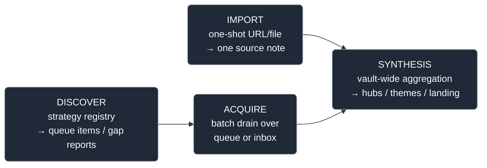
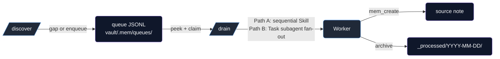
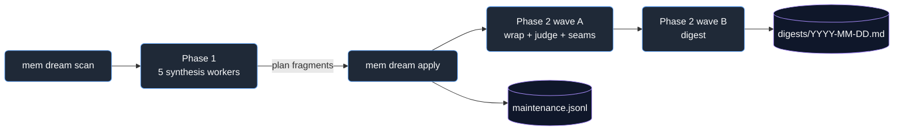
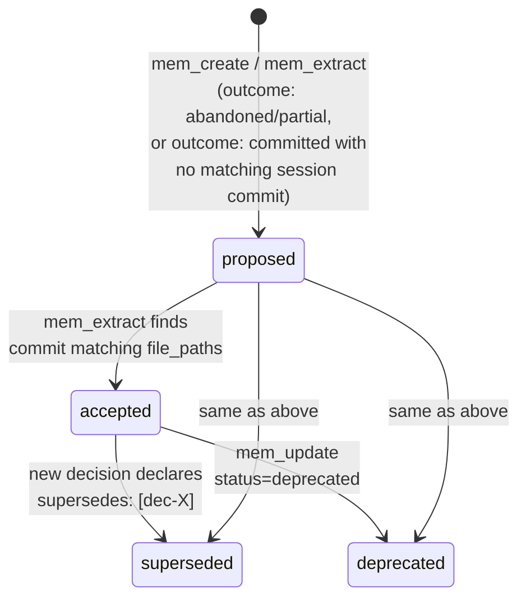

# personal_mem — Architecture

## Document roles

| Doc | Audience | Purpose |
|---|---|---|
| `README.md` | New users | Pitch, quickstart, install. |
| `CLAUDE.md` | Agents in-session | Retrieval contract, lifecycles, operational rules. |
| `ARCHITECTURE.md` (this) | Contributors | Layer boundaries, source primitive, capability lanes, coherence mechanics. |
| `docs/ARCHITECTURE_NOTES.md` | Contributors (deep-dive) | Worked examples, mechanism deep-dives, historical decisions spilled out of this doc. |

If you're answering a user question in-session, read `CLAUDE.md` first. If you're reading code or adding a new source type, you're in the right place.

## Two layers

personal_mem splits cleanly into two layers with a one-way dependency.

```
┌─────────────────────────────────────────────────────────────────────────┐
│ Claude Code layer                                                       │
│   commands/*.md (skills) + surfaces/hooks/ (SessionStart, Pre, Post, Stop)│
└────────────────────────────────────┬────────────────────────────────────┘
                                     │  (imports only)
                                     ▼
┌─────────────────────────────────────────────────────────────────────────┐
│ Knowledge layer (src/personal_mem/)                                     │
│   core/         schemas, config, vault, indexer, embeddings, events     │
│   retrieval/    search, context, temporal                               │
│   synthesis/    hubs, concepts, themes, landing, judge                  │
│   acquisition/  the discover → drain spine                              │
│     sources/      registry, frontmatter, queue, intake, extractors      │
│     discover/     strategy registry (decision_review, rss_poll, mail_poll, …)│
│     importers/    one-shot CLI importers (chatgpt, claude_history, …)   │
│   operations/   pure functions consumed by both surfaces                │
│   surfaces/     cli/, mcp/, hooks/                                      │
└─────────────────────────────────────────────────────────────────────────┘
```

Dependency rule: `core/` imports nothing from the rest; `retrieval/` and `synthesis/` import only from `core/` and their neighbors; `operations/` may import any of the above but never from `surfaces/`. Surfaces are thin shells that delegate to `operations/`. If you find yourself wanting to import `surfaces.*` from `core/`, you're mixing concerns.

The Claude Code layer sits on top: hooks feed session events into the knowledge layer via the CLI; skills drive the knowledge layer via MCP tools. Both are clients of the knowledge API; neither is a peer.

## The source primitive

A **source** is a note of `type: source` representing external content — a paper, repo, article, newsletter post, conversation export. Every source type is declared once in `src/personal_mem/acquisition/sources/registry.py` as a `SourceTypeSpec`:

```python
SourceTypeSpec(
    slug="paper",
    bucket="papers",
    layout="folder",            # flat | folder | author_folder
    aliases=("arxiv",),
    skills=("research", "discover"),
    temporal_grain="concept",   # event | concept | none
)
```

`VaultManager.create_note` reads the registry, normalises the incoming `source_type`, and dispatches on `spec.layout`:

- **`flat`** — single file at `bucket/<slug>.md`. Used by `conversation` (ChatGPT exports).
- **`folder`** — `bucket/<slug>/source.md` with companion files (`raw.md`, `snapshot.md`, `paper.pdf`, …) alongside. The usual choice.
- **`author_folder`** — `bucket/<author>/<slug>/source.md`. Used by substack so each publication's corpus clusters under one folder. Falls back to `folder` when `author` is missing.

`temporal_grain` decides whether the source type produces theme signals: `event` (news, substack, newsletter-events, podcast-events, youtube-events) triggers theme floating in `/dream`; `concept` (paper, repo, article, newsletter-concepts, podcast-concepts, youtube-concepts) routes to concept hubs; `none` (conversation) does neither.

**The registry is open-world** — a source with an unregistered `source_type` falls through to the `folder` layout with an empty bucket. Behaviour (drain, dedup, queue path) is closed-world — `/drain --source-type undeclared` errors. This asymmetry is intentional: experimentation is cheap, but production paths require a registry entry.

See [ARCHITECTURE_NOTES.md §"Canonical source frontmatter"](docs/ARCHITECTURE_NOTES.md#canonical-source-frontmatter) for the full frontmatter table.

## Capability lanes

A source type can sit on up to four capability lanes. Each is optional; most types implement one or two.



Each lane maps to skill files under `commands/`:

| Lane | Skills | Owns |
|---|---|---|
| import | `/research`, `/research-paper`, `/research-repo`, `/research-article`, `/news`, `/capture`, `/ingest-paper-file` (the last three are agent-internal — invoked by routers/workers, not symlinked as public `/` commands) | URL/file → one source note |
| acquire | `/drain`, `/substack`, `/newsletter`, `/youtube`, `/podcast` | Queue/inbox → many source notes |
| discover | `/discover` | Strategy registry: internal-state gap emitters (`decision_review`, `prompt_gap`) + external-trigger enqueuers (`rss_poll`, `mail_poll`, `external_tool_runner`) |
| synthesis | `/update-hubs`, `/themes-resolve`, `/dream`, `/mem-wrap`, `/mem-resolve-concepts` | Concept hubs, theme hubs, landing docs, ontology hygiene, session wrap |

The four lanes are verb-distinct on purpose. **Import** is one-shot (a URL or file the user hands you). **Acquire** is batch (a queue or inbox the user has been accumulating). **Discover** finds what's missing. **Synthesis** aggregates what's already in the vault — concept-hub backfill, theme dedup, landing-doc regeneration. None of these is a sub-mode of another; mixing them is what produced the historical naming drift the Phase 1 rename sweep (1.1) cleaned up.

Skills declare their lane via YAML frontmatter `capabilities: [...]`. `mem skill list` reads these headers.

### Source-type acquisition spine

The discover → drain spine is the only producer/consumer rail. Every source type lands on this shape:



Path A (sequential) is for `paper`, `repo`, `article`. Path B (subagent fan-out) is for `news`, `youtube-*`, `newsletter-*`, `podcast-*` — high item-count source types where parallel writers pay off.

Some flows legitimately skip discover: `/substack` and `mem import {chatgpt|claude-history}` because the user (or an external export) has already done the discovery step; `/news <url>` and `/research <url>` because they're one-shot URL bypasses.

### Dream orchestrator (two-phase, mirrors /drain)

`/dream` is the second orchestrator in the repo. Same idiom as `/drain` (config-driven dispatch from a typed registry, scoped per-domain workers with strict JSON outcome contract, parallel fan-out, deterministic apply tail), specialised for the synthesis + composition + consumption lane instead of acquisition:



- **Phase 1 (synthesis)** — 5 workers in parallel: `dream-{promotion,merge,theme,essence,priority}-worker`. Each emits a `plan_fragment` JSON outcome. Orchestrator merges, calls `mem dream apply` (one index rebuild, one `maintenance.jsonl` line).
- **Phase 2 (composition + consumption)** — 5 workers in dependency waves. Wave A in parallel: `dream-wrap-worker` (catch-up unwrapped sessions, subsumes the standalone `/mem-wrap` cron) + `dream-judge-worker` (drain rejudge queue, subsumes `/judge-prediction --drain`) + `dream-seam-link-worker` (drain `.mem/seam_link_queue.jsonl` — cross-parent catalyst linkage on hubs folded by merges) + `dream-seam-worker` (reconcile the CC-auto-memory↔vault **memory seam** — see below). Wave B after wave A: `dream-digest-worker` (compose `type: digest` note at `vault/projects/<p>/digests/YYYY-MM-DD.md`). Phase-2 workers write directly; they emit a `side_effects` list, not plan fragments.

**Extensibility seam.** `src/personal_mem/operations/dream_tasks.py::DreamTaskSpec` is the typed registry, structurally analogous to `sources/registry.py::SourceTypeSpec`. A new judgment, composition, or consumption domain plugs in via one `REGISTRY` entry (`surface_key, worker_name, plan_keys, has_signal, phase, depends_on`) plus one `.claude/agents/<worker>.md` file — no skill-text or orchestrator-code edits. Dependency edges (`depends_on`) let the orchestrator topologically sort the fan-out without per-domain branching.

**Operational vs epistemic separation (per dec-719e47e0 + n-d31cc330).** The dream report at `vault/reports/dream/<cycle_id>.md` is *operational* (what apply did this cycle). The digest at `vault/projects/<p>/digests/YYYY-MM-DD.md` is *epistemic* (what your knowledge gained today). Same orchestrator, separate workers, separate output files, separate prompt framings — no data-level conflation despite shared dispatch.

### Memory seam — CC auto-memory ↔ vault reconciliation

Two always-on knowledge channels feed every session and are assembled *independently*: **Claude Code auto-memory** (`~/.claude/projects/*/memory/*.md`, the *durable* layer — preferences, feedback, hard-won lessons) and **the vault SessionStart payload** (the *fresh* layer — recent sessions / decisions / state, regenerated each session). The seam is the missing reconciliation between them — an active correctness guard that keeps the durable layer from going **stale** against, or silently **duplicating**, the fresh layer (empirically, staleness concentrates in `project`-type CC facts that race the vault — "14 MCP tools" when the vault has 18 — and almost never in durable `feedback` facts).

The mechanic splits deterministic-Python from agent-judgment, exactly like concepts/themes:

- **`synthesis/memory_seam.py`** (embedding-free) walks the CC memory files into fact records keyed by content hash + mtime, diffs them against the durable state map (`vault/.mem/memory_seam.json`) to find the **dirty** set (new / edited / previously-unresolved / recheck-due), computes the deterministic `project`-type+age stale prior, and renders the report. It resolves no twins and calls no embedding API — so the dream *scan* keeps its API-free contract.
- **`dream-seam-worker`** (phase 2, Wave A) does the irreducibly-semantic half: for each dirty fact it resolves the vault twin via `mem_search(mode='similar')`, bands the cosine (`seam.cosine_twin` / `seam.cosine_none`), reads the twin, and rules `confirmed-fresh` / `stale` / `diverged` / `durable-unique`. It writes verdicts back through **`mem seam commit`**, which recomputes the durable map from the *current* CC files (so a verdict can never attach to stale text), carries forward clean facts' priors, and renders `vault/.mem/memory_seam.md`.

The map is incremental — steady-state cost is ~0 (a clean cycle spawns no worker). Verdicts persist in the JSON map; unresolved ones (`stale`/`diverged`) re-validate every cycle, resolved ones re-validate every `seam.recheck_days` to catch *vault* drift.

**Serving is a session-scoped lens, not a banner.** The map is *not* dumped at SessionStart. `synthesis/memory_seam.py:session_guard_section` builds a reverse index (`twin_note_id → flagged fact`) over the `stale`/`diverged` verdicts and intersects it against the note ids the boot payload actually served (`parse_returned_ids(payload)` in the SessionStart hook). A guard line is injected at the top of the payload **only** when a note the model is about to rely on is the twin of a durable CC memory the seam flagged — "memory X may be stale: 14 tools vs 18 → cross-check `[[dec-…]]` (in your context)". No served twin matches → nothing injected (the common case). Because the intersection runs first, the live drift re-check (re-hash the CC file to flag "edited since this verdict") only touches the handful of facts whose twins are in context, not all ~138 — so the hook stays fast.

**Two consumers, by design — and deliberately no third.** (1) The full `memory_seam.md` is the human-facing **maintenance report** — "these N durable CC memories have drifted from the vault, go fix the files" — which is where stale flags earn their keep. (2) The boot guard is a zero-cost-when-silent correctness interrupt for the rare case both a stale memory and its fresh counterpart land in the same boot context. A **mid-session on-the-fly guard was considered and rejected** (2026-06-13): it's redundant. The seam's `verdict_reason` carries the substance (the pointer id is disposable); within-session supersession chains are the model's own edits (it already knows); and cross-session-but-pre-dream supersessions are *recent decisions* that the standard boot payload (`build_project_context`) already serves via the `supersedes:` chain + STATE. The only residual case (model fetches an old twin whose contradiction is too subtle to read off the note itself) is too thin to justify a hook on every retrieval.

## Ontology as the joint vocabulary

The ontology is what glues the knowledge layer together. Every note — regardless of type or project — can carry a `concepts` frontmatter list. Notes that share ≥`concept_edge_threshold` concepts (default 1) auto-link in the graph. Concept hubs (`vault/concepts/topics/{concept}.md`) aggregate learning artifacts across the whole vault.

Loading is centralised in `src/personal_mem/synthesis/concepts.py:load_ontology` — a minimal YAML parser with no external dependencies. Skills read the file directly (no MCP round-trip) because it's small and changes rarely.

New terms a skill encounters go into `proposed_concepts`, not `concepts`. The gate is **server-enforced** — `mem_extract`, `mem_create`, and the importers all run incoming concept lists through the merged ontology and shunt non-matches to `proposed_concepts` automatically. Promotion to canonical requires `/mem-resolve-concepts` review (threshold: config `dream.promotion_threshold`, default `count ≥ 5`).

The ontology ties everything together because it's the only vocabulary shared across sources, decisions, sessions, notes, and concept hubs. A concept named in any of these places is the same concept. That's how a paper's finding can inform a decision on an unrelated project — they share a concept, so the graph connects them.

The shipped `ontology.yaml` is a minimal seed. The framework is opinion-free about which domains a vault grows; `ontology.example.yaml` shows one mature vault's shape but no domain hierarchy is privileged.

## Adding a new source type

The five-step pattern — registry entry → config defaults → skill file → optional research subskill → smoke test — is documented end-to-end in [ARCHITECTURE_NOTES.md §"Adding a new source type"](docs/ARCHITECTURE_NOTES.md#adding-a-new-source-type) with a worked `podcast` example. Nothing else in the framework should need to change.

## Themes vs concept hubs

Both hubs share the same spine (`## Essence` + append-only `## Catalyst log` using the flag grammar `new` / `agrees` / `contradicts` / `extends`), implemented exactly once in `synthesis/hub.py`. They differ on identity, lifecycle, and citation direction:

|  | **Concept hub** | **Theme hub** |
|---|---|---|
| Identity | vocabulary term (e.g. `finance/regime`) | UUID (e.g. `thm-aaaa1111`) |
| Auto-update | yes (`/update-hubs` extracts) | no (mint + extend via `/dream`) |
| Lifecycle | none — concepts don't die | `active → dormant → resolved` (manual only) |
| Citation | `concepts: [...]` frontmatter | `relates_to: [thm-X]` frontmatter |
| Resolution skill | `/mem-resolve-concepts` | `/themes-resolve` |
| Storage | `vault/concepts/topics/{name}.md` | `vault/themes/{thm-X}-{slug}.md` |

The disambiguation test, registry mechanics (`themes.yaml`), and per-source-type theme floating (event-grain vs concept-grain) live in CLAUDE.md §3 "Theme" + §4 — that's the agent-facing rules-of-the-road. ARCHITECTURE.md only points to the structural file.

The temporal DAG renderer (Mermaid catalysts + decisions) is shared infrastructure in `retrieval/temporal.py`: both concept hubs and themes parse the same `flag[ ref]` log grammar, build a `TemporalGraph`, and render via the same primitive.

## Queue primitive

Per-source-type acquisition state lives in plain JSONL on disk — never inside the vault's note graph:

```
vault/.mem/queues/
  paper.jsonl                 # active queue (one JSON per line)
  _processed/2026-05-03/paper.jsonl   # archived items, status stamped
```

The `Queue` class (`sources/queue.py`) is the single API:

```python
q = Queue.for_source_type("paper", vault_root)
q.enqueue({"url": "...", "title": "..."})
item = q.dequeue()                  # FIFO; skips claimed
q.archive(item_id, status="done")   # → dated archive
conflict = q.dedup_check(item)      # active + N-day archive + SQLite URL check
```

Items get a UUID `id` and `enqueued_at` timestamp on enqueue if absent. Claims are written via tempfile + `os.replace` (atomic per-process); the design assumes a single user, not concurrent workers.

`dedup_check` consults the active queue + the last `SourceTypeSpec.dedup_lookback_days` of archive (7 for news, 30 for slower types) **plus** the SQLite indexer (URL already a `type: source` note). The indexer guard covers re-emits months later that the archive lookback misses. Keys come from `sources.<type>.dedup_keys` in `sources.yaml`.

The queues directory is excluded from the SQLite index — acquisition state is not knowledge.

## User configuration layout — `vault/config/`

All human-edit configuration files live under `vault/config/`. The hidden `vault/.mem/` directory is for runtime/derived state only (SQLite DBs, JSONL queues, batch buffers, logs).

```
vault/
├── config/                        # human-edit, top-level, visible
│   ├── PRIORITIES.yaml            # focus signals + intake registries (Phase 3.1)
│   ├── sources.yaml               # per-source-type behaviour overlay
│   ├── source_types.yaml          # registry overlay (optional)
│   ├── ontology.yaml              # canonical concept vocabulary
│   ├── concept_aliases.yaml       # near-dup mappings
│   ├── themes.yaml                # theme registry (code appends mints)
│   └── flows.yaml                 # cron flow definitions
├── .mem/                          # runtime state only
│   ├── config.toml                # engine policy knobs (see below)
│   ├── embeddings.db, index.db*, queues/, buffer/, hubs_*, …
│   └── (no other human-edit files)
└── …                              # vault content (concepts/, sources/, themes/, …)
```

Loaders use a backwards-compatible fallback (`vault/config/<filename>` → `vault/.mem/<filename>`) so pre-Phase-3.1 vaults keep working. Writes always commit forward to `vault/config/`. Legacy-location reads emit a one-per-session stderr deprecation warning.

### `vault/config/config.toml` — engine policy knobs

The vault-internal TOML (tier 3 of `core/config.py:load_config`) owns the engine-level policy values: embedding provider, edge-generation thresholds, and the behavioural knobs below. Every knob has a built-in default equal to the value the engine shipped with — an absent file or block changes nothing. This file is deliberately **not** PRIORITIES.yaml (research focus + intake registries) and not sources.yaml (per-source-type operational tuning); it is the "how the machine behaves" layer.

```toml
[embeddings]      # model, api_key_env, api_url

[edges]           # concept_threshold (1), concept_max_freq_pct (0.05),
                  # tag_threshold (2), tag_max_freq_pct (0.10), tag_exclude

[dream]
enqueue_priority_signals = false   # gate: priority signals may write queues
compute_pagerank = false           # per-concept PageRank after rebuilds
essence_cap = 12                   # essence candidates surfaced per scan (0 = unlimited)
cosine_threshold = 0.8             # drift-v2 centroid-cosine merge floor
drift_cap = 15                     # drift pairs surfaced per scan (0 = unlimited)
coarsen_threshold = 0.85           # near-clique floor for grain coarsening (stricter than cosine_threshold)
coarsen_cap = 3                    # coarsen clusters surfaced per scan, per family (concept + theme)
coarsen_max_size = 6               # max members in one coarsening cluster
coarsen_apply = true               # true = nightly auto-applies the fold; false = surface-only for /tighten approval
seam_link_cap = 10                 # folded hubs the seam-link worker drains per cycle
promotion_threshold = 5            # min proposed-concept count for promotion eligibility
promotion_cap = 20                 # promotion candidates surfaced per scan
probe_window_days = 14             # probe-pressure lookback (recent_probes + knowledge-delta)
rejudge_cap = 20                   # rejudge entries handed to the judge worker per cycle
knowledge_delta_hours = 24         # digest-worker knowledge-delta window
essence_max_catalysts = 10         # catalysts shipped per essence candidate
essence_placeholder_max_catalysts = 25  # …for placeholder essences (compose-fresh needs more)

[seam]                             # CC-auto-memory ↔ vault reconciliation (dream-seam-worker)
cosine_twin = 0.70                 # ≥ this = a real vault twin exists (worker inspects it)
cosine_none = 0.55                 # < this = no twin → durable-unique (CC-only knowledge)
stale_age_days = 30                # project-type CC fact untouched this long → stale prior
recheck_days = 14                  # re-validate resolved verdicts after this long (catch vault drift)
cap = 20                           # dirty CC facts handed to the seam worker per cycle

[extract]
insights_cap = 3                   # max insight notes per mem_extract call

[themes]                           # cluster detection (synthesis/theme_candidates)
min_cluster_size = 3               # smallest concept cluster that surfaces a signal
recent_days = 30                   # event-grain source lookback
min_shared_concepts = 2            # concepts a concept-cluster must share
name_family_jaccard = 0.5          # slug-token Jaccard that folds proposed_theme variants
generic_concept_ratio = 0.5        # df ratio above which a concept is "generic"
resolve_after_days = 60            # active theme with no catalyst entry in N days auto-resolves (0 = disabled)

[landing]
open_probes_cap = 20               # prompt-probes gathered into the landing context
probes_display_cap = 10            # probes shown in STATE.md "Open Probes"

[retrieval]
rrf_k = 60                         # RRF fusion constant for hybrid search

[retrieval.prompt_time]            # R2 enrichment (enabled, min_similarity, caps, …)
```

The `mem dream scan` flags (`--promotion-cap`, `--promotion-threshold`, `--essence-cap`) override their config fields per-invocation; cron (which passes no flags) is steered by the file.

### `PRIORITIES.yaml` — discover bias + intake registries

Two-section file owning the user-steerable surface that governs `/discover` mechanics and what external-trigger strategies enqueue:

```yaml
focus:
  active_projects: [...]            # foreground in landing docs
  watch_themes: [thm-...]           # surface in STATE.md + bias /discover
intake:
  news:               {outlets, drain_window_days}
  podcast_events:     {outlets}
  podcast_concepts:   {outlets}
  youtube_events:     {channels, lookback_days, drain_batch_max}
  youtube_concepts:   {channels, lookback_days, drain_batch_max}
  newsletter_events:  {senders, mail_query, label_overrides}
  newsletter_concepts:{senders, mail_query, label_overrides}
```

Loaded by `sources/priorities.py`. Read by `rss_poll` and `mail_poll` strategies (PRIORITIES.yaml wins; legacy paths fall back).

**Per-strategy thresholds + per-project strategy lists stay in `sources.yaml`** (operational tuning, not priorities — they're set once during onboarding and rarely revisited).

## User configuration — `sources.yaml`

`vault/config/sources.yaml` overlays per-vault defaults onto the shipped `DEFAULT_CONFIG` in `src/personal_mem/acquisition/sources/config.py`. Four top-level sections, all optional:

```yaml
sources:                       # per-source-type overrides
  paper:
    queue: vault/.mem/queues/papers.jsonl
    dedup_keys: [arxiv_id, doi, url, title]
    url_patterns: [arxiv.org, openreview.net]
projects:                      # per-project knobs
  default: {discover_strategies: []}
  myresearch:
    discover_strategies: [decision_review]
    decision_review: {stale_days: 45}
landing_files:                 # filename overrides
  state: STATE.md
  decisions: DECISIONS.md
auto_todo_extraction: true
```

The optional `vault/config/source_types.yaml` overlay (loaded by `sources/registry.py`) registers new `SourceTypeSpec` entries at runtime — vault-side source-type extensions without forking the framework. See [ARCHITECTURE_NOTES.md §"sources.yaml vs source_types.yaml"](docs/ARCHITECTURE_NOTES.md#sourcesyaml-vs-source_typesyaml) for the open/closed asymmetry.

`mem_sources_config` MCP exposes the merged dict to skills that don't want to re-parse the YAML themselves. The CLI exposes `mem sources list` / `mem sources show <slug>` for the registry view.

## Discovery strategies

`/discover` is the producer rail. It loads `projects.<name>.discover_strategies` from `sources.yaml`, dispatches to a registered strategy, and returns gap descriptors or queue items.

| Strategy | Flavor | What it does |
|---|---|---|
| `decision_review` | internal-state | Surfaces `proposed`/`accepted` decisions older than `stale_days` |
| `prompt_gap` | internal-state | Surfaces hyphenated-compound terms probed about that aren't in the ontology |
| `rss_poll` | external-trigger | Polls RSS feeds (news outlets, YouTube channels); directly enqueues |
| `mail_poll` | external-trigger | Composes a Gmail query → emits a plan `/newsletter` executes against Gmail MCP |
| `external_tool_runner` | external-trigger | Shells out to user-defined commands; reads JSONL stdout, merges into gap list |

Internal-state strategies describe a need (concept/decision metadata); external-trigger strategies write the queue. Forcing gap-emitters to enqueue would conflate "scan and report" with "decide what to do" — the latter legitimately lives in `/discover`.

Each strategy lives in its own file under `src/personal_mem/acquisition/discover/strategies/` and implements the `Strategy` protocol (`_protocol.py`) — adding a new one is **one file plus one `register()` line** in `strategies/__init__.py`. This directory is the framework's growth axis post-launch.

## Decision lifecycle

A decision note has a `status` frontmatter field with four legal values:



- `synthesis/judge.py` is **read-only** — emits a verdict (`kept`/`superseded`/`reverted`/`unknown`) from structural evidence (was the file committed? did tests pass? was it re-edited later?). Never writes back. Verdict-to-status writeback lives in `operations/decisions.mem_judge_and_writeback` (`kept→accepted`, `superseded→superseded`, `reverted→deprecated`, `unknown→no change`).
- The only auto-flip in the system is the `supersedes`-declared one above, where the writer made the relationship explicit.
- Decisions can carry a `predicted_outcome:` prose string with claim + manifestation pointer. The `/judge-prediction` skill (not an API call — the running session IS the judge) writes verdicts to `prediction_history`. See [ARCHITECTURE_NOTES.md §"RLVR substrate"](docs/ARCHITECTURE_NOTES.md#rlvr-substrate--decision-context-capture) for the projection and export pipeline.

Note frontmatter is open-set — the indexer preserves unrecognized keys without modification, so downstream consumers can extend the schema (e.g. with `pipeline`, `run_id`, or other integration-specific keys) without forking the framework.

## Coherence — how the vault avoids duplication

Six distinct dedup mechanisms, each scoped to a different kind of overlap:

| Scenario | Mechanism | Where |
|---|---|---|
| Concept overlap (near-dupes) | drift v2: string rules ∪ centroid-cosine ≥ 0.8 (`synthesis/geometry.py`), verdict-history-excluded | `/dream` scan (`drift_pairs`); `mem doctor` / `mem concepts drift` for the advisory view |
| Concept merge | rename across notes + FOLD hub into winner + archive tombstone + seam-link enqueue | `mem concepts merge`, `/dream` apply (`merges`) |
| Source slug collision | filesystem check, auto-increments (`<slug>-1`, `-2`, …) | `VaultManager.create_note` |
| Note content dup | SHA-256 over body | indexer (skips on insert) |
| Theme dedup | drift v2 cosine over theme embeddings → `merge_theme_into` (fold + repoint + `merged-into:` tombstone) | `/dream` (`theme_dup_candidates` → `theme_merges`); `/themes-resolve` on demand |
| Queue item dedup | `dedup_keys` from `sources.yaml` + indexer URL check | `Queue.dedup_check` |

Since the 2026-06-11 drift-v2 doctrine, dedup-merge for both hub families mutates automatically inside `/dream` — logged in the maintenance line's `verdicts` block (which doubles as the judgment memory the next scan excludes against) and reversible (folded hubs are archived/status-tombstoned, never deleted). Everything else either flags (`doctor`), silently sidesteps (slug auto-increment, hash skip), or defers to the on-demand skills.

**Seam-link invariant: entries never change hubs without a seam-link pass.** A fold (concept or theme merge — and any future hub *split*) produces two disjoint catalyst DAGs in one file; the fold stamps `fold_pending_from`/`fold_pending_dates` and enqueues the winner on `.mem/seam_link_queue.jsonl`. The phase-2 `dream-seam-link-worker` judges cross-parent entry pairs only and writes through `mem hubs apply-linkage` (`validate_linkage_revision`-gated; `--clear-fold` clears the stamps and retires the queue item atomically).

**Embeddings freshness.** Hybrid and similarity retrieval read from `<vault>/.mem/embeddings.db` (rebuildable from markdown). Without an external trigger nothing repopulates it as new content lands, so similarity silently degrades to FTS-only on recent content. The keep-warm contract is a cron line (`mem index --embed --only-new`) that re-embeds only the delta. `mem doctor` flags a stale DB (`embeddings.db` mtime > 7 days) when `OPENAI_API_KEY` is set.

## Invocation surface

The framework's *internal* contracts (layer dependencies, operations seam, retrieval modalities) are codified above. This section codifies the *external* contracts — every name an outside system (Claude Code, cron, another agent) can bind to. **These are public API. Renaming any of them breaks consumers we can't see.**

| Surface | Name | Stability | What breaks if it moves |
|---|---|---|---|
| Console script | `mem` | stable | every shell invocation, every cron job, every `claude -p` autopilot line |
| Console script | `mem-hook` | stable | every Claude Code session (registered in `.claude/settings.json` by `mem hooks install`) |
| Console script | `mem-mcp` | stable | every MCP-server config that addresses personal_mem |
| MCP tool name | `mem_search`, `mem_create`, `mem_read`, `mem_update`, `mem_link`, `mem_unlink`, `mem_context`, `mem_graph`, `mem_concepts`, `mem_extract`, `mem_judge`, `mem_landing`, `mem_enrich`, `mem_timeline`, `mem_project_snapshot`, `mem_queue`, `mem_sources_config`, `mem_prompts` | stable | every skill that calls the tool by name |
| Module entry | `python -m personal_mem.surfaces.mcp.server` | stable | rare — prefer the `mem-mcp` console script |
| Module entry | `python -m personal_mem.mcp.server` | back-compat shim | external configs that haven't migrated to `mem-mcp` yet |
| Hook subcommands | `mem-hook {session_start,user_prompt_submit,pre_tool_use,post_tool_use,stop}` | stable | every entry in `.claude/settings.json` written by `mem hooks install` |
| Skill files | `commands/<name>.md` filenames | stable | `/<name>` invocations and the `.claude/plugins/personal-mem/` symlinks |
| YAML keys | `sources.<slug>.{queue,research_skill,drain_strategy,dedup_keys,url_patterns,intake_folder}`, `projects.<name>.{discover_strategies,…}`, `landing_files.{state,backlog,decisions,themes,research_focus}`, `auto_todo_extraction` | stable | every user's `vault/config/sources.yaml` |

The rule: when restructuring internal modules, treat anything in this table as an immovable identifier. Internal layout (`personal_mem/foo/bar.py`) is private; the names here are the contract. If you must rename one, add a back-compat alias for one release before removing.

### Surface contract — CLI ↔ MCP

The boundary principle: **MCP tools are the agent operation surface; the CLI is for admin, cron, and headless skill orchestration** — plus exactly four narrow *agent-Bash* entries that in-session agents and dream workers invoke from a Bash tool mid-flow: `mem wrap-finalize`, `mem hubs apply-linkage`, `mem landing --doc`, and `mem judge --rejudge/--drain`. Everything else an agent needs goes through `mem_*` MCP tools; everything a human or crontab needs goes through `mem`. Where both surfaces exist for one operation, they are thin wrappers over the same `operations/` function (see "Operations layer" below). The contract is pinned mechanically by `tests/test_surface_contract.py` (schema↔dispatch wiring, doc-referenced subcommands, worker tool allowlists, inventory counts); `_DISPATCH` in `surfaces/cli/__init__.py` is grouped by the same audience labels.

Full inventory — 43 CLI subcommands × 18 MCP tools (audience: *agent* = MCP-only, *admin-cron* = CLI-only, *both* = paired surfaces; *agent-Bash* marks the four CLI carve-outs):

| Operation | CLI subcommand | MCP tool | Audience |
|---|---|---|---|
| Search (FTS / similar / hybrid) | `mem search` | `mem_search` | both (CLI = retrieval debug) |
| Budgeted context blob | `mem context` | `mem_context` | both (CLI = retrieval debug) |
| Graph walk (filter-dispatched) | `mem graph` | `mem_graph` | both (CLI = retrieval debug) |
| Read one note | `mem show` | `mem_read` | both (CLI = retrieval debug) |
| Timeline window | `mem timeline` | `mem_timeline` | both (CLI = retrieval debug) |
| Project snapshot | `mem project-snapshot` | `mem_project_snapshot` | both (CLI = retrieval debug) |
| Prompt / probe surfacing | `mem prompts` | `mem_prompts` | both (CLI = retrieval debug) |
| Create note | `mem add` | `mem_create` | both (CLI = headless flows) |
| Update note | `mem update` | `mem_update` | both (CLI = headless flows) |
| Add typed edge | `mem link` | `mem_link` | both (CLI = headless flows) |
| Remove typed edge | `mem unlink` | `mem_unlink` | both (CLI = headless flows) |
| Concept ops (action-dispatched) | `mem concepts` | `mem_concepts` | both (CLI = hygiene orchestration) |
| Session extraction | — | `mem_extract` | agent |
| Decision / prediction judging | `mem judge` | `mem_judge` | both — `--rejudge/--drain` is **agent-Bash** |
| Landing docs regeneration | `mem landing` | `mem_landing` | both — `--doc` is **agent-Bash** |
| Concept enrichment | `mem enrich` | `mem_enrich` | both (CLI = admin-cron backfill) |
| Acquisition-queue inspection | `mem queue` | `mem_queue` | both |
| Source-type registry | `mem sources` | `mem_sources_config` | both |
| /mem-wrap deterministic tail | `mem wrap-finalize` | — | **agent-Bash** |
| Hub backfill / linkage | `mem hubs` | — | admin-cron — `apply-linkage` is **agent-Bash** |
| Decision ledger lookup | `mem decisions` | — | admin-cron |
| Todo backlog | `mem backlog` | — | admin-cron |
| SQLite index rebuild | `mem index` | — | admin-cron |
| Importers (claude-mem / chatgpt / …) | `mem import` | — | admin-cron |
| Vault health | `mem stats` | — | admin-cron |
| Coherence linter | `mem doctor` | — | admin-cron |
| Named workflow pipelines | `mem flow` | — | admin-cron |
| Host scheduler render | `mem schedule` | — | admin-cron |
| Hook install / status | `mem hooks` | — | admin-cron |
| Vault init | `mem init` | — | admin-cron |
| MCP server registration | `mem install` / `mem uninstall` | — | admin-cron |
| Hook pause toggle | `mem pause` / `mem resume` | — | admin-cron |
| MCP server entry point | `mem mcp` | — | admin-cron (infrastructure) |
| Drop-folder intake helpers | `mem intake` | — | admin-cron |
| Skill registry inspection | `mem skill` | — | admin-cron |
| Queue drain (consumer rail) | `mem drain` | — | admin-cron (orchestration) |
| Discovery strategies (producer rail) | `mem discover` | — | admin-cron (orchestration) |
| Dream scan / apply | `mem dream` | — | admin-cron (orchestration) |
| Themes registry rebuild | `mem themes` | — | admin-cron |
| Project registry | `mem project` | — | admin-cron |
| Orphan session pruning | `mem prune-orphans` | — | admin-cron |
| RLVR substrate export | `mem rlvr` | — | admin-cron |

## Operations layer

`src/personal_mem/operations/` is the seam between surfaces (CLI, MCP) and the two lower layers: the knowledge layer (`core/`, `retrieval/`, `synthesis/`) and the acquisition layer (`acquisition/` — the discover → drain spine: `acquisition/sources/`, `acquisition/discover/`, `acquisition/importers/`). Note creation, concept queries, hub backfill, etc. are implemented exactly once here, then consumed by both surfaces.

```
surfaces/cli/  surfaces/mcp/         ← thin wrappers (5-10 LOC per handler)
       │             │
       └──────┬──────┘
              ▼
    operations/                      ← pure functions
      notes.py        create / read / update / link / unlink
      search.py       query_fts / query_similar / query_hybrid / query_context / query_prompts
      concepts.py     list / tighten / merge / drift / source_counts / search
      decisions.py    list_by_file / judge_and_writeback
      queue.py        list_queues / peek / inspect / enqueue (auto-dedup)
      hubs_batch.py   run_hubs_batch — orchestrator over agent_client.batch_completions_sync
      _backfill_route.py  choose_route — picks inline (CC skill) vs batch (wrapper fan-out)
      dream.py        scan + apply for /dream synthesis + hygiene cycle
      wrap.py         /mem-wrap deterministic tail (prune → index → judge → landing → drift)
      rlvr_export.py  decision-context RLVR substrate export
              ▼
   core/, retrieval/, synthesis/  acquisition/   ← knowledge + acquisition layers
```

Dependency rule: operations may import from `core/`, `retrieval/`, `synthesis/`, `acquisition/`, but never from `surfaces/`. CLI and MCP handlers import from operations, not from the knowledge layer directly. So `cmd_add` (CLI) and `mem_create` (MCP) both delegate to `operations.notes.create_note(cfg, …)` — the same call, the same code path.

Operations functions take a `Config` (or `VaultManager` / `Indexer`) plus parameters and return data. They don't `print` and they don't call `sys.exit`. Surfaces own input shape (argparse / JSON) and output shape (text / JSON).

## LLM provider abstraction — `core/agent_client.py` + `core/embedding_provider.py`

Pre-2026-06-06 personal_mem talked to three providers (OpenAI, Anthropic, Gemini) through three SDKs and four httpx call sites, with provider-specific Batches dances in `operations/hubs_batch.py` and `onboarding/enrich_batch.py`. After the API consolidation refactor (plan: `.claude/plans/go-back-to-the-scalable-firefly.md`):

```
            vault/config/api.yaml
            completion.{provider, model, max_tokens, batch_concurrency}
            embeddings.{provider, model}
            overrides.<op>.{provider, model, ...}
                            │
                            ▼ resolve_for_op() / embeddings_config()
            ┌───────────────┴───────────────┐
            ▼                               ▼
core/agent_client.py            core/embedding_provider.py
(AsyncOpenAI + per-provider     EmbeddingProvider protocol
 base_url for Anthropic /         OpenAI (httpx, default)
 Gemini OpenAI-compat)            SentenceTransformer (local)
                                  LiteLLM passthrough
get_completion / batch_completions     embed(texts) -> vectors
            │                               │
            ▼                               ▼
   Consumers (backfill ops)        Consumers (embedding paths)
   • operations/hubs_batch.py      • core/embeddings.py
   • onboarding/enrich_batch.py    • retrieval/search.py (mode='similar')
   • importers/chatgpt.py          • mem index --embed
   • enrich.py
   • surfaces/cli/_hubs_link.py
   (news-triage subagent stays on
    CC Task path, not the wrapper)

CARVE-OUT:
   • sources/extractors/gemini_extract.py — podcast audio Files API
     (direct google.genai; no chat-completion shape covers it)
```

Dual-route surfaces (`--via {inline,batch}`) pick between the wrapper (batch) and a CC skill (inline) via `operations/_backfill_route.choose_route`.

## A note on the importers under `src/personal_mem/acquisition/importers/`

These are **one-shot CLI importers**, not skills. They're called via `mem import <source> <path>` and handle bulk migration from external formats: ChatGPT exports, claude-history databases, Messenger self-exports, plain text files. They live next to the knowledge layer because they speak directly to `VaultManager`, but they're not part of the capability model — a contributor adding a new source type should usually write a skill (procedural markdown) rather than a CLI importer (Python module). The importers exist because some source formats predate the skill model; new work should go through skills.
